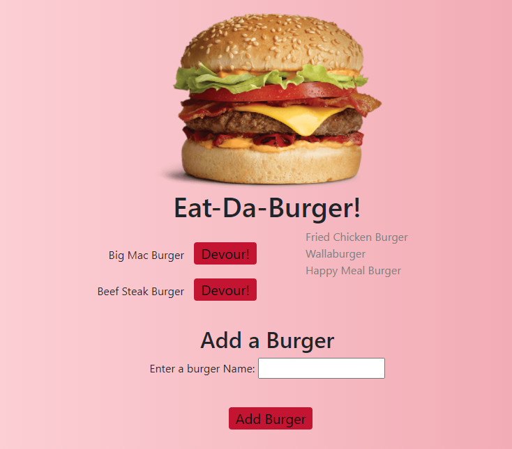

# Burger-Logger
  
  

## Description
This application is a burger logger with MySQL, Node, Express, Handlebars and a homemade ORM . This application has been followed the MVC design pattern; use Node and MySQL to query and route data in the app, and Handlebars to generate the HTML.

- Eat-Da-Burger! is a restaurant app that lets users input the names of burgers they'd like to eat.

- Whenever a user submits a burger's name, your app will display the burger on the left side of the page -- waiting to be devoured.

- Each burger in the waiting area also has a Devour it! button. When the user clicks it, the burger will move to the right side of the page.

- The app will store every burger in a database, whether devoured or not.

## Table of Contents
- [Description](#description)
- [Installation](#installation)
- [Technology](#technology)
- [Link to GitHub](#linktogithub)
- [Screenshots](#screenshots)
- [License](#license)
- [Contributing](#contributing)
- [Questions](#questions)

## Installation
- In order to run the application, use:
npm start

## Technology 

- Node.js
- MySQL
- JAWSQL
- Express
- Handlebars
- ORM

## Link to GitHub:
[GitHub](https://github.com/wendyVo/burger.git)

## Link to Deployed Applicaion:

[DemoLink](https://burger-2305.herokuapp.com/)

## Screenshots:
- Eat da Burger Restaurant
 

## License

 
This application is covered under  license. 

## Contributing
Contributors: Wendy Vo  
Please read this [Setting guidelines for repository contributors](https://docs.github.com/en/github/building-a-strong-community/setting-guidelines-for-repository-contributors) for more informations.

## Questions

Please contact me should you have any questions:  
:email:   Email: uyen199247@gmail.com  
:octocat: GitHub:  [wendyVo](https://github.com/wendyVo)

